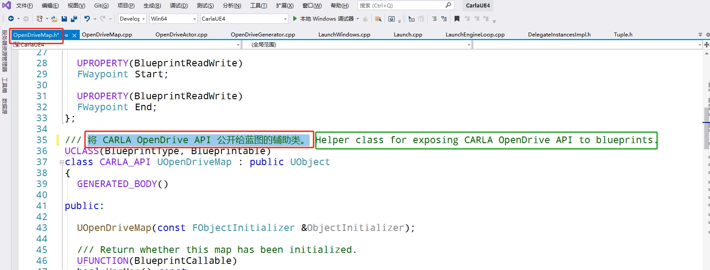

# Carla 的 C++ 文档
## 生成文档
1.下载并安装[git](https://git-scm.com/downloads) 、[GitTortoiseGit](https://tortoisegit.org/download/) 、[doxygen](https://www.doxygen.nl/download.html) ；

2.克隆仓库：
```shell
git clone https://github.com/OpenHUTB/carla_cpp.git
```

3.在项目主目录下运行以下命令，根据 C++ 代码生成对应的 html 文档：
```shell script
doxygen
```
生成的文档位于`carla_cpp\Doxygen\html`目录下，包括的文档：
- LibCarla/source/carla：[Doxygen/html/dir_b14cdd661f9a7048a44f1771cd402401.html](https://openhutb.github.io/carla_cpp/dir_b14cdd661f9a7048a44f1771cd402401.html) 

- CarlaUE4：[Doxygen/html/dir_8fc34afb5f07a67966c78bf5319f94ae.html](https://openhutb.github.io/carla_cpp/dir_8fc34afb5f07a67966c78bf5319f94ae.html) 

4.修改并本地测试没问题后，提交代码：
```shell script
git add .
git commit -m update
git push
```

## 修改方法
### 修改类的注释
1.比如对于`UOpenDriveMap`，修改之前：


2.找到需要修改的文件：


3.翻译代码中的注释或添加新注释：


4.运行`doxygen`重新生成文档，查看修改后的文档：


## 新建开发分支
直接创建一个空白的分支，而是像普通的分支一样把原分支的内容拷贝过来：
```shell
git checkout --orphan dev
```
还需要手动删除孤立分支中的内容：
```shell
git rm -rf .
```